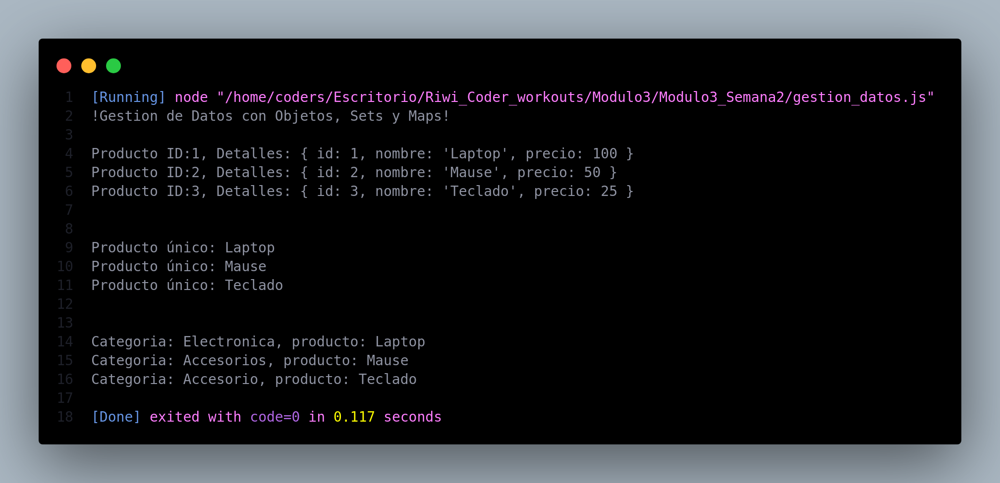

# Gestión de Datos con Objetos, Sets y Maps

El objetivo de esta hoja de trabajo es guiarte a desarrollar un programa en JavaScript para
consolidar tus conocimientos sobre estructuras de datos avanzadas, como objetos, sets y maps.
Aprenderás a organizar y manipular información de forma eficiente, mientras practicas métodos y
bucles que te permitirán recorrer y gestionar datos de manera estructurada.

**Tu tarea es crear un programa que:**

1. Almacene información de productos utilizando un objeto con las siguientes propiedades:
    1. id (clave única del producto).
    2. nombre (nombre del producto).
    3. precio (valor numérico del producto).
2. Convierta los datos del objeto a un Set para garantizar que no haya duplicados.
3. Use un Map para agregar información adicional a cada producto (ej., categoría como clave y
nombre del producto como valor).
4. Imprima y recorra los datos utilizando bucles como for...in y for...of, así como métodos como
forEach()

## Resultado en Consola

