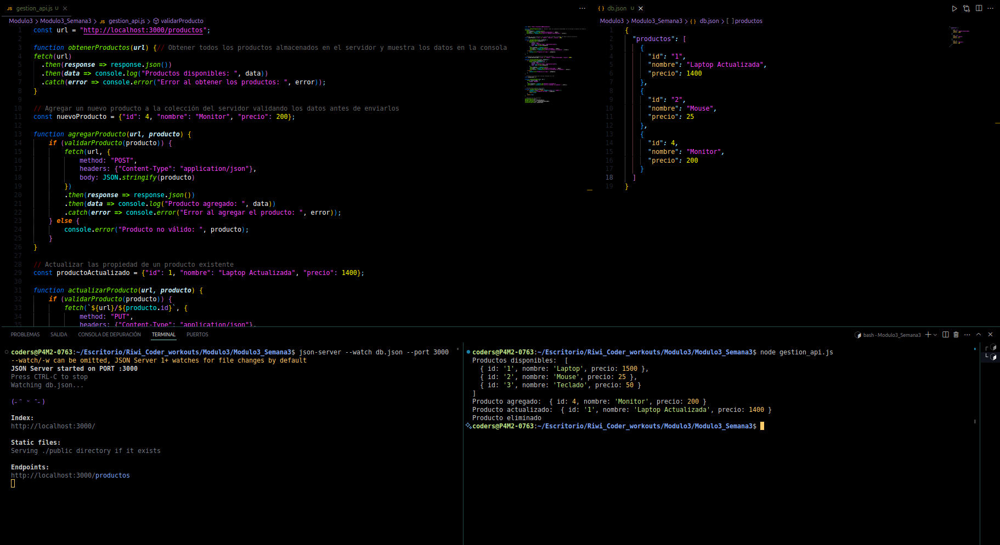
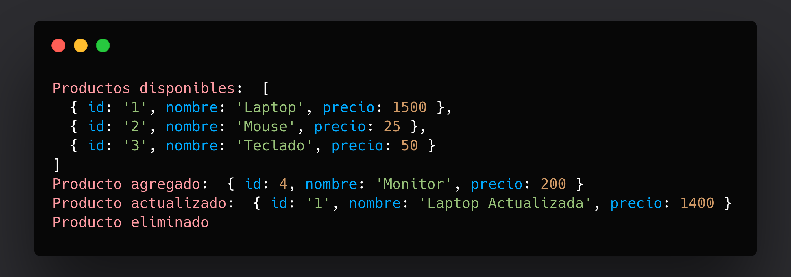

# Gestión de Productos con Node.js y JSON Server

Este proyecto es un ejemplo básico de cómo gestionar un inventario de productos (obtener, agregar, actualizar y eliminar) usando **Node.js** como cliente y **json-server** como API REST falsa.

```Riwí, Jhos Kevin Agudelo Moreno clan Hopper```

---

## Características

- Listar productos almacenados en el servidor.
- Agregar un nuevo producto.
- Actualizar un producto existente.
- Eliminar un producto por ID.
- Validar los datos antes de enviarlos al servidor.

---

## Estructura del proyecto

```bash
Modulo3_Semana3
├── db.json         # Base de datos simulada para json-server
└── gestion_api.js  # Script principal que realiza las operaciones CRUD
```

---

## Requisitos previos

- Node.js 16 o superior (recomendado Node 18+).
- [json-server](https://github.com/typicode/json-server) instalado globalmente o como dependencia local.

---

## Instalación

1. Clona este repositorio o descarga los archivos.
2. Instala las dependencias (solo si usas Node < 18):

   ```bash
   npm install node-fetch
   ```

---

## Ejecutar el servidor de la API

Inicia json-server en el directorio donde esté tu archivo `db.json`:

```bash
json-server --watch db.json --port 3000
```

La API estará disponible en: [http://localhost:3000/productos](http://localhost:3000/productos)

---

## Ejecutar el script de gestión

En otra terminal, ejecuta el script principal con Node:

```bash
node gestion_api.js
```

---

## Descripción del código

- **obtenerProductos()**: lista todos los productos actuales.
- **agregarProducto()**: agrega un nuevo producto si pasa la validación.
- **actualizarProducto()**: actualiza un producto existente basado en su ID.
- **eliminarProducto()**: elimina un producto por ID.
- **validarProducto()**: verifica que el producto tenga nombre y precio válido.

El script utiliza `fetch` para interactuar con la API REST en formato JSON.

---

## Tecnologías utilizadas

- Node.js
- fetch API (o [node-fetch](https://www.npmjs.com/package/node-fetch) en versiones antiguas de Node)
- [json-server](https://github.com/typicode/json-server)

---

## Notas importantes

- Asegúrate de usar `http://` en la URL del servidor, ya que **json-server** por defecto no soporta HTTPS.

---

## Resultado

Proceso en vsCode


Respuesta en consola

