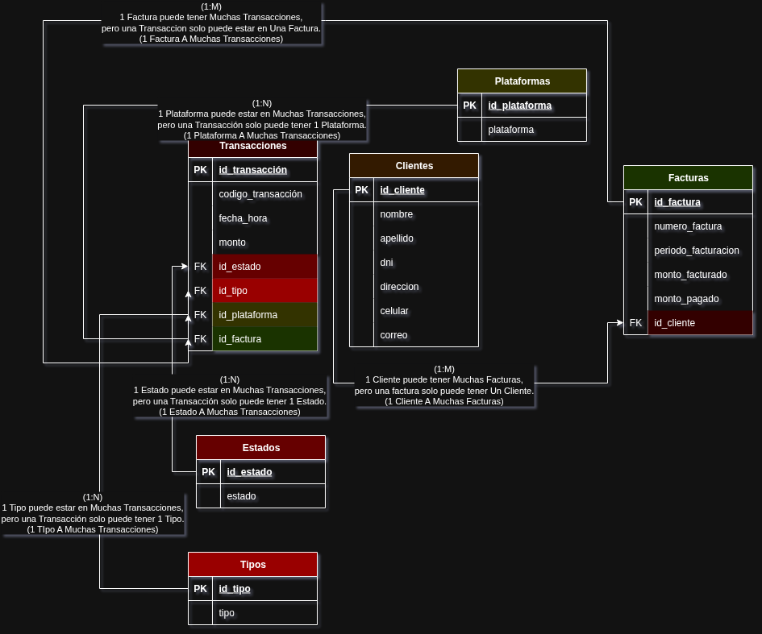

# Prueba de Desempeño – Módulo 4

**Autor:** Jhos Kevin Agudelo Moreno  
**Clan:** Hopper  
**Correo:** [jhoskevinagudelomoreno@gmail.com](mailto:jhoskevinagudelomoreno@gmail.com)  
**Documento:** CC. 1035972277

---

## Descripción del Proyecto

La aplicación permite cargar masivamente datos desde archivos `.csv` (Clientes, Facturas y Transacciones), almacenarlos en una base de datos MySQL y visualizar los datos automáticamente desde el navegador. También cuenta con la funcionalidad para eliminar toda la información de las tablas.

---

## Funcionalidades

- Subida individual de archivos `.csv` para:
  - Clientes
  - Facturas
  - Transacciones

- Visualización automática en tablas HTML de los datos cargados.

- Botón para eliminar **todos** los datos de todas las tablas de la base de datos.

---

## Estructura del Proyecto

```text
Modulo4_Prueba_De_Desempeño/
│
├── Backend/
│ ├── CSV/ # Archivos .csv de ejemplo para cargar
│ │ ├── clients.csv
│ │ ├── invoices.csv
│ │ └── transactions.csv
│ │
│ ├── node_modules/ # Dependencias de Node.js
│ ├── csvs.js # Lógica para procesar archivos CSV
│ ├── db.js # Conexión a la base de datos MySQL
│ ├── index.js # Servidor Express y rutas
│ ├── package.json # Configuración del proyecto Node
│ └── package-lock.json
│
├── Frontend/
│ ├── index.html # Interfaz de usuario
│ └── main.js # Lógica de interacción y consumo del backend
│
├── CreateDataBase.sql # Script SQL para crear base de datos y tablas
├── M4.drawio.png # Diagrama relacional del modelo de datos
└── README.md # Documentación del proyecto
```

---

## Instalación y Ejecución

### 1. Clonar el Repositorio

```bash
git clone https://github.com/Moren0k/Riwi_Coder_workouts.git
cd Modulo4/Modulo4_Prueba_De_Desempeño/Backend
npm install
```

### Crear la Base de Datos

Ejecuta los comandos del archivo `CreateDataBase.sql`.

### Ejecutar el Servidor

Desde la carpeta Backend:

```bash
node index.js
```

El servidor se iniciará en [http://localhost:3000/](http://localhost:3000)

### Abrir el Frontend

Ve a la carpeta Frontend.  
Abre el archivo `index.html` en tu navegador.

---

## Tecnologías Utilizadas

| Herramienta | Uso                           |
|-------------|-------------------------------|
| Node.js     | Backend y servidor            |
| Express     | Creación de rutas REST        |
| MySQL       | Base de datos relacional      |
| csv-parser  | Lectura de archivos CSV       |
| multer      | Manejo de archivos en backend |
| dotenv      | Variables de entorno          |
| Bootstrap   | Diseño y maquetación web      |
| HTML, JS    | Frontend e interactividad     |

```bash
# En la carpeta del Backend se instaló:
# (express, mysql2, csv-parser, multer, cors, dotenv)
npm init -y
npm i express mysql2 csv-parser multer cors dotenv
```

---

## Modelo de Datos Relacional

### Relaciones entre Entidades

- Un Cliente puede tener muchas Facturas.
- Una Factura pertenece a un único Cliente.
- Una Factura puede tener múltiples Transacciones (pagos parciales o completos).
- Una Transacción solo puede pertenecer a una única Factura.
- Una Factura puede tener:
  - Un único Estado que cambia
  - Un único Tipo
  - Una única Plataforma de pago

Estas relaciones están representadas gráficamente en el siguiente diagrama entidad-relación:



`Un Cliente puede tener muchas Facturas, las Facturas solo pueden tener un Cliente, para realizar el pago una Factura puede tener varias Transacciones pero una Transacción solo puede ser a una Factura, la Factura puede tener varios Estados, diferentes Tipos y puede ser en distintas Plataformas (Pero solo a una FACTURA).`

---

Un Cliente puede tener muchas Facturas, las Facturas solo pueden tener un Cliente, para realizar el pago una Factura puede tener varias Transacciones pero una Transacción solo puede ser a una Factura, la Factura puede tener varios Estados, diferentes Tipos y puede ser en distintas Plataformas (Pero solo a una FACTURA).

**ID Transaccion** TXN001,  
**Fecha y Hora** 2024-06-01 10:00:00,  
**Monto** 38940,  
**Estado** Pendiente,  

**Tipo** Pago de Factura,  

**Nombre** Angel Daniel,  
**DNI** 149186547,  
**Direccion** "USNS DavisFPO AP 78518",  
**Celular** (873)222-2692x09480,  
**Correo** [miller@boyer.com](mailto:miller@boyer.com)  

**Plataforma** Nequi,  

**Numero_Factura** FAC7068,  
**Periodo Facturacion** 2024-06,  
**Monto_Facturado** 39940,  
**Monto_pagado** 0  

Angel Daniel (DNI, Dirección, Celular, Correo), tiene una Numero_Factura: FAC7068, del periodo 2024-06, un Monto_Facturado 39940, y un Monto_Pagado 0, realiza una transacción de tipo Pago de Factura, con ID_Transaccion TXN001 con Fecha y Hora 2024-06-01 10:00:00 y paga un monto de 38940 y el estado de la transacción es Pendiente.

---

El cliente Angel Daniel (DNI 149186547) tiene asociada la factura FAC7068 del periodo 2024-06, con un monto facturado de $39.940. Este cliente realiza una transacción con ID TXN001 por un monto de $38.940 el día 2024-06-01 a través de Nequi. El estado de la transacción es Pendiente.

---
