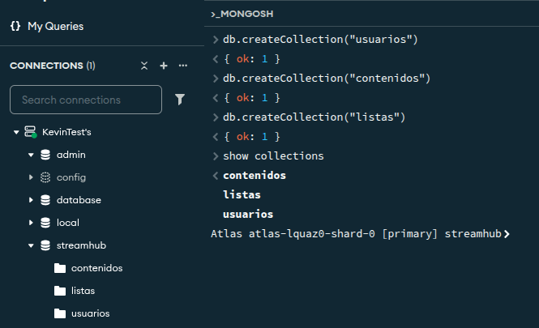
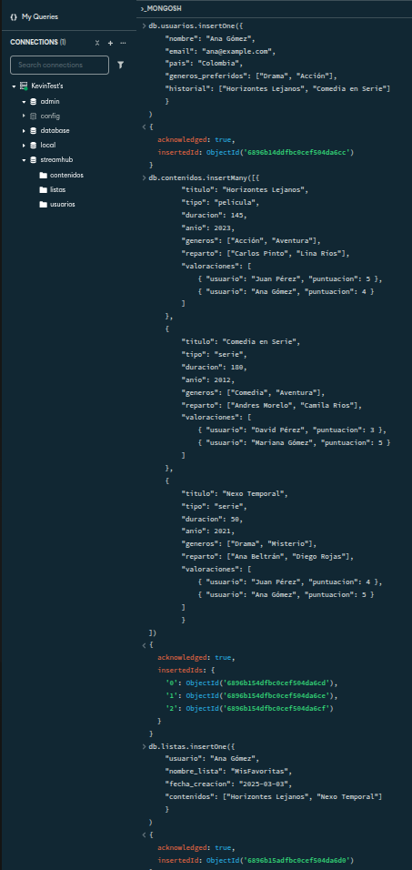
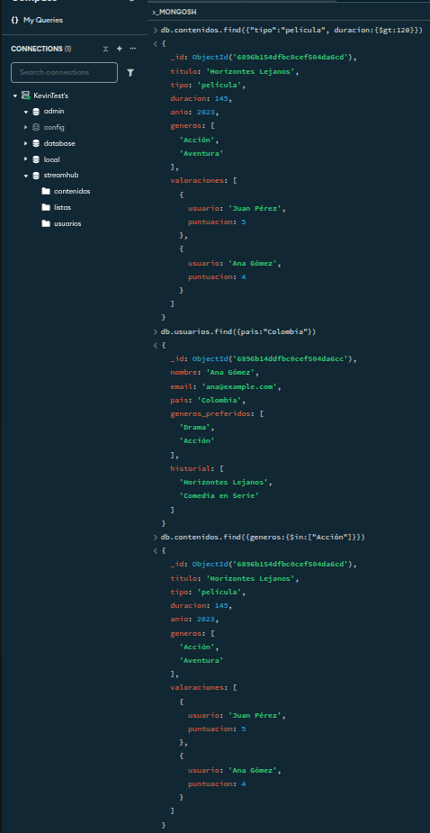
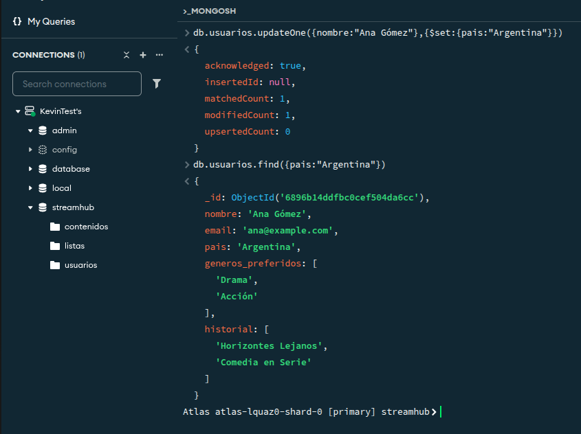
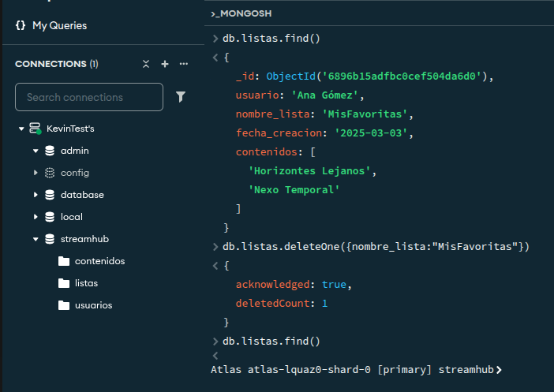
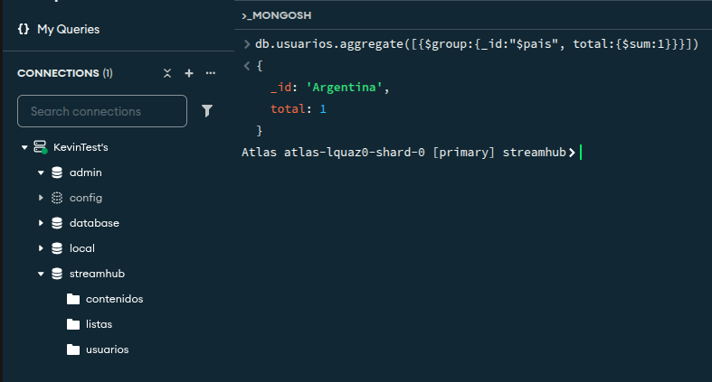
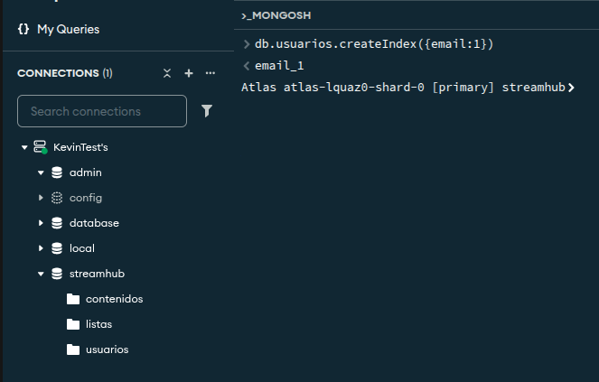

# Problema que resolver: sistema de Gestión de Contenido para Plataforma de Streaming

**StreamHub** enfrenta problemas por manejar su catálogo y actividad de usuarios con hojas de cálculo aisladas, generando datos inconsistentes y búsquedas lentas. Para solucionarlo, se implementará una base de datos NoSQL que registre *películas*, *series*, *usuarios*, *historiales*, *listas de reproducción* e *interacciones*. El objetivo es optimizar consultas, unificar la información y permitir personalización, recomendaciones y análisis del comportamiento de los usuarios.

---

## Identificamos las colecciones necesarias

**usuarios:**
    - nombre
    - email
    - pais
    - generos_preferidos
    - historial
`db.createCollection("usuarios")`
  
**contenidos:**
    - titulo
    - tipo ("pelicula" o "serie")
    - duracion
    - anio
    - generos
    - valoraciones
`db.createCollection("contenidos")`

**listas:**
    - usuario
    - nombre_lista
    - fecha_creacion
    - contenidos
`db.createCollection("listas")`



---

## Ingresar los documentos

Usamos `insertOne()` para insertar 1 documento a la coleccion **Usuarios.**

```js
db.usuarios.insertOne({
    "nombre": "Ana Gómez",
    "email": "ana@example.com",
    "pais": "Colombia",
    "generos_preferidos": ["Drama", "Acción"],
    "historial": ["Horizontes Lejanos", "Comedia en Serie"]
    }
)
```

Usamos `insertMany([])` para insertar 2 documentos a la coleccion **Contenidos.**

```js
db.contenidos.insertMany([{
        "titulo": "Horizontes Lejanos",
        "tipo": "película",
        "duracion": 145,
        "anio": 2023,
        "generos": ["Acción", "Aventura"],
        "reparto": ["Carlos Pinto", "Lina Ríos"],
        "valoraciones": [
            { "usuario": "Juan Pérez", "puntuacion": 5 },
            { "usuario": "Ana Gómez", "puntuacion": 4 }
        ]
    },
    {
        "titulo": "Comedia en Serie",
        "tipo": "serie",
        "duracion": 180,
        "anio": 2012,
        "generos": ["Comedia", "Aventura"],
        "reparto": ["Andres Morelo", "Camila Ríos"],
        "valoraciones": [
            { "usuario": "David Pérez", "puntuacion": 3 },
            { "usuario": "Mariana Gómez", "puntuacion": 5 }
        ]
    },
    {
        "titulo": "Nexo Temporal",
        "tipo": "serie",
        "duracion": 50,
        "anio": 2021,
        "generos": ["Drama", "Misterio"],
        "reparto": ["Ana Beltrán", "Diego Rojas"],
        "valoraciones": [
            { "usuario": "Juan Pérez", "puntuacion": 4 },
            { "usuario": "Ana Gómez", "puntuacion": 5 }
        ]
        }
])
```

Usamos `insertOne()` para insertar un documento a la colección **listas.**

```js
db.listas.insertOne({
    "usuario": "Ana Gómez",
    "nombre_lista": "MisFavoritas",
    "fecha_creacion": "2025-03-03",
    "contenidos": ["Horizontes Lejanos", "Nexo Temporal"]
    }
)
```



---

## Consultas

1. Películas con más de 120 minutos de duración.
   `db.contenidos.find({tipo:"pelicula", duracion:{$gt:12}})`

2. Usuarios de Colombia.
   `db.usuarios.find({pais:"Colombia"})`

3. Contenidos de género "Acción".
   `db.contenidos.find({generos:{$in:["Accion"]}})`



---

## Actualizaciones

1. Cambiar el pais de un usuario.
   `db.usuarios.updateOne({nombre:"Ana Gómez"},{$set:{pais:"Argentina"}})`

2. Agregar un nuevo género preferido a un usuario.
   `db.usuarios.updateOne({nombre:"Ana Gómez"},{$set:{generos_preferidos:["Ciencia Ficción"]}})`

3. Actualizar una valoración de un contenido.
   `db.contenidos.updateOne({titulo:"Nexo Temporal","valoraciones.usuario":"Ana Gómez"},{$set:{"valoraciones.$.puntuacion":4}})`



---

## Eliminaciones

1. Eliminar un usuario.
   `db.usuarios.deleteOne({nombre:"Ana Gómez"})`

2. Eliminar un contenido.
   `db.contenidos.deleteOne({titulo:"Nexo Temporal"})`

3. Eliminar una lista.
   `db.listas.deleteOne({nombre_lista:"MisFavoritas"})`

4. Eliminar todos los contenidos de un género específico.
   `db.contenidos.deleteMany({generos:{$in:["Misterio"]}})`



---

## Agregaciones

1. Contar el número de usuarios por país.
   `db.usuarios.aggregate([{$group:{_id:"$pais", total:{$sum:1}}}])`

2. Obtener el promedio de duración de contenidos por género.
   `db.contenidos.aggregate([{$unwind:"$generos"},{$group:{_id:"$generos", promedio_duracion:{$avg:"$duracion"}}}])`

3. Listar los contenidos con al menos 2 valoraciones.
   `db.contenidos.aggregate([{$match:{"valoraciones.1":{$exists:true}}}])`



---

## Índices

1. Índice en el campo "email" de la colección usuarios.
   `db.usuarios.createIndex({email:1})`

2. Índice compuesto en los campos "tipo" y "anio" de la colección contenidos.
   `db.contenidos.createIndex({tipo:1, anio:-1})`

3. Índice en el campo "nombre_lista" de la colección listas.
   `db.listas.createIndex({nombre_lista:1})`



---
