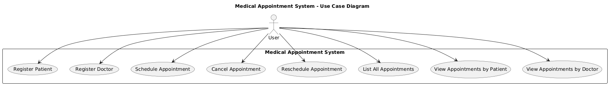
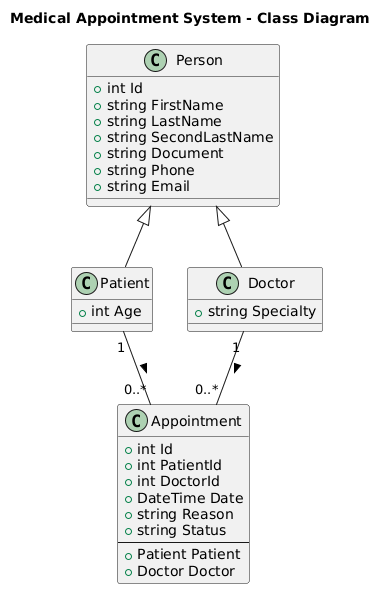
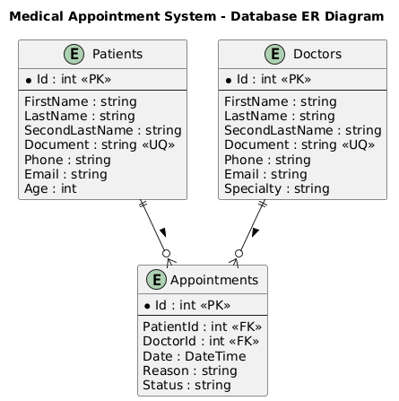
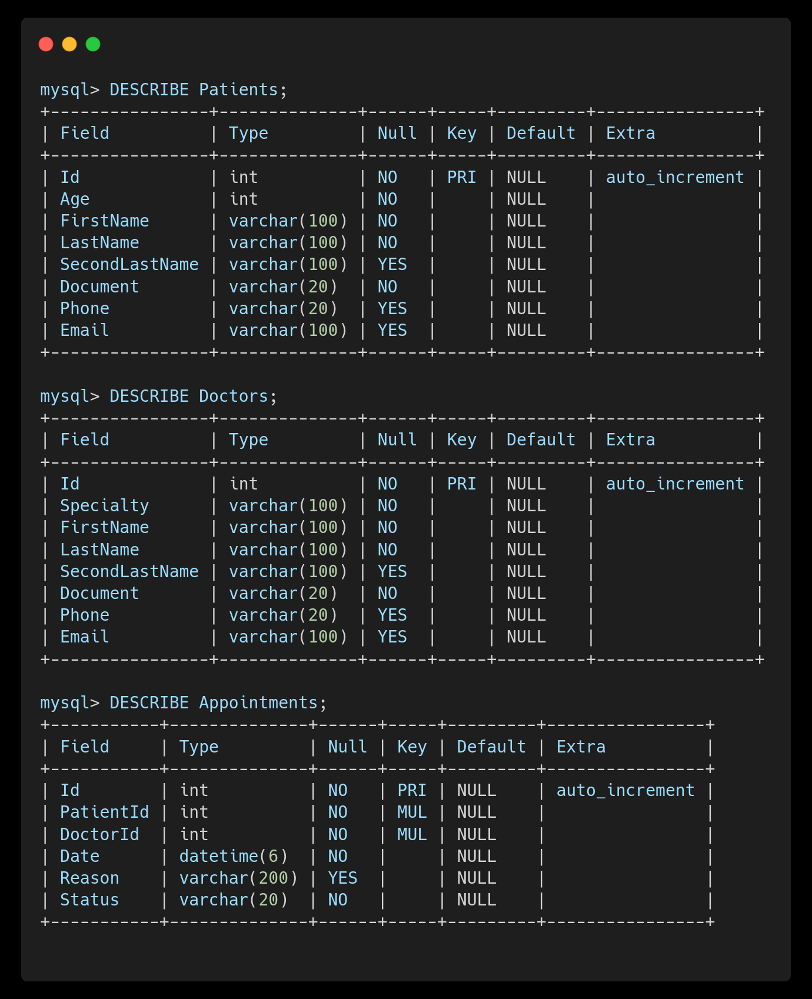

# Hospital San Vicente

## Descripción del problema

El Hospital San Vicente actualmente gestiona sus citas médicas en agendas físicas y hojas de cálculo. Este método ha generado múltiples problemas:

    • Duplicidad de citas para el mismo médico o paciente.
    • Dificultad para encontrar la información de un paciente.
    • Falta de control sobre médicos y sus especialidades.
    • Pérdida de información cuando las agendas se dañan o extravían.

La gerencia del hospital decidió desarrollar un sistema interno en c# que permita organizar de forma eficiente las citas médicas, pacientes y médicos.

## Objetivo general

Desarrollar un sistema de gestión de citas médicas para el Hospital San Vicente que permita
centralizar la información de pacientes, médicos y citas, optimizando la programación y
gestión de citas mediante una aplicación en C# que garantice la integridad, consistencia y
accesibilidad de la información.

## Objetivos específicos

1. Diseñar una base de datos relacional utilizando MySQL la cual incluya tablas para:
    pacientes, médicos y citas, asegurando la integridad referencial y la normalización de los
    datos.
2. Implementar la lógica de negocio: Desarrollar las clases y métodos necesarios para gestionar
    la información de pacientes, médicos y citas.
3. Crear una interfaz de usuario: Diseñar y desarrollar una interfaz de usuario intuitiva y
    fácil de usar que permita a los usuarios interactuar con el sistema de manera eficiente.
4. Validar y manejar errores: Implementar validaciones para asegurar que los datos ingresados
    cumplan con las reglas de negocio y manejar errores de manera adecuada para garantizar la
    robustez del sistema.
5. Probar el sistema: Realizar pruebas exhaustivas para asegurar que todas las funcionalidades
    del sistema funcionen correctamente y que la información se gestione de manera eficiente.
6. Documentar el sistema: Crear documentación detallada que incluya la arquitectura del
    sistema, instrucciones de uso y procedimientos de mantenimiento.

## Requisitos del sistema

1. **Base de datos**: Utilizar MySQL para almacenar la información.
2. **Lenguaje de programación**: C# con .NET 6.0
3. **ORM**: Entity Framework Core para la gestión de la base de datos
4. **Validaciones**: Implementar validaciones para asegurar la integridad de los datos
5. **Manejo de errores**: Implementar manejo de excepciones para garantizar la robustez del sistema
6. **Interfaz de usuario**: Aplicación web (ASP.NET Core)
7. **Documentación**: Documentar el código y el sistema desarrollado
8. **Pruebas**: Realizar pruebas unitarias y de integración para asegurar la calidad del sistema
9. **POO**: Aplicar principios de Programación Orientada a Objetos en el diseño del sistema
10. **Control de versiones**: Utilizar un sistema de control de versiones como Git para gestionar el código fuente

## Descripción general del sistema

El sistema de gestión de citas médicas para el Hospital San Vicente es una aplicación web desarrollada en C# utilizando ASP.NET Core y Entity Framework Core con MySQL como base de datos. El sistema permite a los usuarios gestionar la información de pacientes, médicos y citas médicas de manera eficiente y segura. La aplicación está diseñada siguiendo los principios de Programación Orientada a Objetos (POO) y aplica validaciones y manejo de errores para garantizar la integridad y robustez del sistema.
El sistema cuenta con una interfaz de usuario intuitiva que facilita la interacción con las diferentes funcionalidades, incluyendo el registro de pacientes y médicos, la programación, cancelación y reprogramación de citas, así como la consulta de citas por paciente o médico. La arquitectura del sistema está diseñada para ser escalable y mantenible, permitiendo futuras mejoras y adaptaciones según las necesidades del hospital.

---

## Diagramas UML

### Diagrama De Casos De Uso



**Descripción:**

- El actor principal es **User**, que representa a la persona que maneja el sistema.
- Las funcionalidades principales son:
    1. **Register Patient:** Registrar un nuevo paciente con sus datos personales.
    2. **Register Doctor:** Registrar un nuevo médico con su especialidad.
    3. **Schedule Appointment:** Crear una cita médica asignando un paciente, un doctor y una fecha.
    4. **Cancel Appointment:** Cambiar el estado de una cita existente a “Cancelada”.
    5. **Reschedule Appointment:** Modificar la fecha de una cita ya programada.
    6. **List All Appointments:** Consultar todas las citas registradas en el sistema.
    7. **View Appointments by Patient:** Consultar todas las citas asociadas a un paciente específico.
    8. **View Appointments by Doctor:** Consultar las citas asignadas a un médico específico.

### Diagrama de Clases



**Clases principales:**

- **Person:** Clase base que concentra los datos comunes (nombre, apellido, segundo apellido, documento, Teléfono y Correo electrónico).
- **Patient:** Hereda de `Person` y agrega su (`Age`).
- **Doctor:** Hereda de `Person` y agrega su (`Specialty`).
- **Appointment:** Representa una cita médica. Contiene los identificadores de paciente y doctor, la fecha, el motivo y el estado
  - Tiene referencias directas (`Patient`, `Doctor`).

**Relaciones:**

- `Person` → `Patient` y `Doctor`: herencia (indicada con `<|--`).
- `Patient` "1" -- "0..*" `Appointment`: un paciente puede tener cero o muchas citas.
- `Doctor` "1" -- "0..*" `Appointment`: un doctor puede atender cero o muchas citas.

### Diagrama Entidad-Relación (ER)



**Entidades:**

- **Patients:** almacena los datos de los pacientes.
- **Doctors:** almacena los datos de los doctores.
- **Appointments:** almacena las citas, relacionando pacientes y doctores mediante `PatientId` y `DoctorId`.

**Relaciones:**

- Un paciente puede tener muchas citas (`Patients ||--o{ Appointments`).
- Un doctor puede atender muchas citas (`Doctors ||--o{ Appointments`).

---

## Estructura del proyecto

```plaintext
    MedicalAppointmentSystem/
    │
    ├── Models/          
    │   ├── Person.cs
    │   ├── Patient.cs
    │   ├── Doctor.cs
    │   └── Appointment.cs
    │   → Definir las entidades.
    │
    ├── Controllers/     
    │   ├── PatientController.cs
    │   ├── DoctorController.cs
    │   └── AppointmentController.cs
    │   → Manejan las solicitudes HTTP (GET, POST, PUT, DELETE) y coordinan la lógica.
    │
    ├── Views/           
    │   ├── Patients/
    │   ├── Doctors/
    │   └── Appointments/
    │   → Contiene las vistas (HTML + C#) que renderizan la interfaz web.
    │
    ├── Data/            
    │   └── AppDbContext.cs
    │   → Maneja la conexión a la base de datos.
    │
    ├── Migrations/
    │   → Contiene las entidades mapeadas con Entity Framework.
    │
    ├── Docs/
    │   ├── UML_Diagrams/
    │   ├── Database.sql
    │   └── README.md
    │   → Guarda tus diagramas, scripts SQL y documentación del proyecto.
    │
    └── Program.cs       
        → Punto de entrada. Configura servicios (MVC, EF, conexión a BD) y ejecuta la app.
```

---

## Instrucciones para ejecutar el proyecto

1. **Clonar el repositorio:**

   ```bash
   git clone https://github.com/Moren0k/Riwi_Coder_workouts.git
   ```

   Navegar a la carpeta del proyecto:

   ```bash
   cd Riwi_Coder_workouts/RutaAvanzada/Prueba_De_Desempeño
   ```

2. **Configurar la base de datos:**
   - Asegúrate de tener MySQL instalado y en ejecución.
   - Crear una modificar el archivo `appsettings.json` con tus credenciales de MySQL:

     ```json
     {
       "ConnectionStrings": {
         "DefaultConnection": "Server=localhost;Database=MedicalDB;User=root;Password=your_password;"
       }
     }
     ```

3. **Ejecutar las migraciones para crear las tablas:**
   - Abre una terminal en la carpeta del proyecto y ejecuta:

        Para crear una nueva migración (si es necesario):

        ```bash
        dotnet ef migrations add InitialCreate
        ```

        Para aplicar las migraciones y crear las tablas en la base de datos:

        ```bash
        dotnet ef database update
        ```

4. **Ejecutar la aplicación:**
   - En la terminal, ejecuta:

     ```bash
     dotnet watch
     ```

   - Abre tu navegador y navega a `http://localhost:5000` para acceder a la aplicación.

*Nota: Asegúrate de tener instalado .NET 6.0 SDK y Entity Framework Core en tu entorno de desarrollo.*

---

## Creación de los modelos

1. **Person.cs** (Clase base)

    ```csharp
    public class Person
        {
            [Key]
            public int Id { get; set; }

            [Required, MaxLength(100)]
            public string FirstName { get; set; } = string.Empty;

            [Required, MaxLength(100)]
            public string LastName { get; set; } = string.Empty;

            [MaxLength(100)]
            public string? SecondLastName { get; set; }

            [Required, MaxLength(20)]
            public string Document { get; set; } = string.Empty;
            
            [MaxLength(20)]
            public string? Phone { get; set; }
            
            [MaxLength(100)]
            public string? Email { get; set; }
        }
    ```

2. **Patient.cs** (Hereda de Person)

    ```csharp
    public class Patient : Person
        {
        [Required]
        public int Age { get; set; }
        }
    ```

3. **Doctor.cs** (Hereda de Person)

    ```csharp
    public class Doctor : Person
        {
            [Required, MaxLength(100)]
            public string Specialty { get; set; } = string.Empty;
        }
    ```

4. **Appointment.cs**

    ```csharp
    public class Appointment
        {
            [Key]
            public int Id { get; set; }

            [Required]
            public int PatientId { get; set; }

            [Required]
            public int DoctorId { get; set; }

            [Required]
            public DateTime Date { get; set; }

            [MaxLength(200)]
            public string? Reason { get; set; }

            [Required, MaxLength(20)]
            public string Status { get; set; } = "Scheduled";

            [ForeignKey(nameof(PatientId))]
            public Patient? Patient { get; set; }

            [ForeignKey(nameof(DoctorId))]
            public Doctor? Doctor { get; set; }
        }
    ```

---

## Base de datos




---

## Autor

Jhos Kevin Agudelo Moreno

- GitHub: [Moren0k](https://github.com/Moren0k)
- LinkedIn: [Kevin Moreno](https://www.linkedin.com/in/jhos-kevin-agudelo-moreno-9b4b79221/)
- Email: [jhoskevinagudelomoreno@gmail.com](mailto:jhoskevinagudelomoreno@gmail.com)
- Documento: 1035972277

Clan Hopper - C# ASP.NET Core

---
