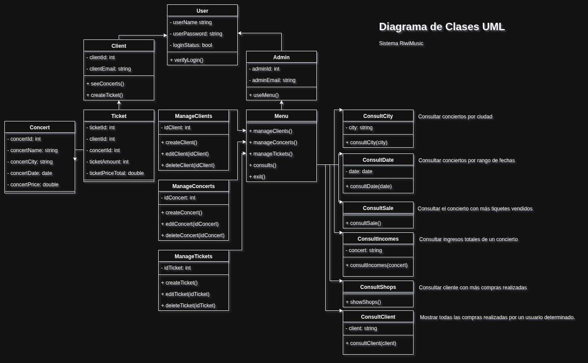
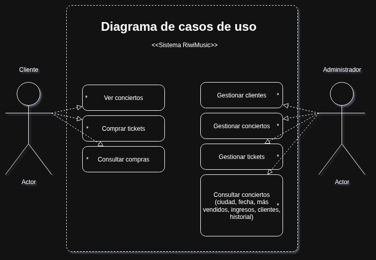

# Sistema RiwiMusic

## Contexto

La empresa RiwiMusic necesita un sistema de consola en C# que permita gestionar sus conciertos, clientes y la venta de tiquetes.  
El sistema no usará bases de datos: toda la información debe almacenarse en Listas dentro de la aplicación.  
El objetivo es simular el proceso completo de registro, consulta y compra de entradas, aplicando los conceptos de programación vistos en clase.

## Menú Principal

1. Gestión de Conciertos  
   - Registrar concierto  
   - Listar conciertos  
   - Editar concierto  
   - Eliminar concierto  

2. Gestión de Clientes  
   - Registrar cliente  
   - Listar clientes  
   - Editar cliente  
   - Eliminar cliente  

3. Gestión de Tiquetes  
   - Registrar compra de tiquete  
   - Listar tiquetes vendidos  
   - Editar compra  
   - Eliminar compra  

4. Historial de Compras  
   - Mostrar todas las compras realizadas por un usuario determinado.  

5. Consultas Avanzadas (LINQ)  
   - Consultar conciertos por ciudad  
   - Consultar conciertos por rango de fechas  
   - Consultar el concierto con más tiquetes vendidos  
   - Consultar ingresos totales de un concierto  
   - Consultar cliente con más compras realizadas  

6. Salir  

## Requisitos técnicos

- Implementar en C# consola.  
- Usar Listas para almacenar la información.  
- Aplicar ciclos (while, foreach) en la navegación y gestión de datos.  
- Usar LINQ para las consultas avanzadas.  
- Aplicar POO: definir las entidades principales como clases (Concierto, Cliente, Compra).  

## Entregables

1. Implementación del sistema RiwiMusic en C# consola.  
2. Justificación de cómo se aplicó POO en el diseño.  
3. Diagrama de Clases UML.  
4. Diagrama de Casos de Uso UML.  

---

## Diagrama de Clases UML

Imagen: Diagrama de Clases UML del sistema RiwiMusic

El sistema está diseñado bajo una arquitectura orientada a objetos y el diagrama de clases define las entidades principales, sus relaciones y responsabilidades.

## Estructura del Diagrama

### **1. Jerarquía de Usuarios**

- `User`: clase base que maneja credenciales y estado de sesión.  
- `Client`: hereda de `User`, puede **ver conciertos** y **comprar tickets**.  
- `Admin`: hereda de `User`, tiene permisos para **gestionar datos y consultas** mediante el `Menu`.

### **2. Entidades Principales**

- `Concert`: representa un concierto con atributos como nombre, ciudad, fecha y precio.  
- `Ticket`: representa la compra de un cliente, enlazando un `Client` con un `Concert` y registrando cantidad y precio total.

### **3. Gestión CRUD**

Existen tres clases dedicadas a administrar entidades:

- `ManageClients`: crear, editar y eliminar clientes.  
- `ManageConcerts`: crear, editar y eliminar conciertos.  
- `ManageTickets`: crear, editar y eliminar tickets.  

Estas operaciones son accesibles únicamente por el administrador.

### **4. Consultas**

El sistema cuenta con clases dedicadas a consultas específicas (implementables con LINQ):

- `ConsultCity`: listar conciertos por ciudad.  
- `ConsultDate`: filtrar conciertos por rango de fechas.  
- `ConsultSale`: obtener el concierto con más tickets vendidos.  
- `ConsultIncomes`: calcular ingresos totales de un concierto.  
- `ConsultShops`: identificar el cliente con más compras.  
- `ConsultClient`: mostrar todas las compras de un cliente.

### **5. Flujo General**

- El **Cliente** solo interactúa con conciertos y tickets.  
- El **Administrador** utiliza el `Menu`, que centraliza la gestión de clientes, conciertos, tickets y consultas.  
- Las consultas y operaciones CRUD están separadas, facilitando la **claridad, escalabilidad y mantenibilidad** del sistema.

---

## Diagrama de Casos de Uso

Imagen: Diagrama de Casos de Uso UML del sistema RiwiMusic

El diagrama de casos de uso muestra las interacciones externas con el **Sistema RiiwiMusic**.  

- El **Cliente** puede ver conciertos, comprar tickets y consultar sus compras.  
- El **Administrador** puede gestionar clientes, conciertos y tickets, además de realizar consultas sobre ventas, ingresos y clientes.  

Este diagrama refleja las funcionalidades principales del sistema desde la perspectiva de los actores.
