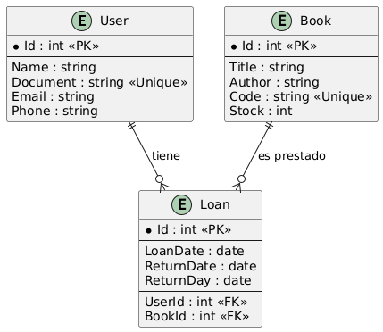

# Biblioteca Digital

## Caso

La biblioteca municipal quiere modernizarse. Actualmente prestan libros en una libreta de apuntes y hojas de Excel, lo que genera problemas como:

- Libros prestados a varios usuarios al mismo tiempo.  
- No hay control sobre qué usuario tiene un libro y hasta cuándo.  
- Dificultad para consultar el historial de préstamos de un usuario.  

---

## Objetivo general

Digitalizar la gestión de usuarios, libros y préstamos de la biblioteca con C#, MVC y EF Core + MySQL.

---

## Requisitos funcionales

### Usuarios

- Registrar usuario con datos: Nombre, Documento, Correo, Teléfono.  
- Documento único.  
- Listar todos los usuarios.

### Libros

- Registrar libro con Título, Autor, Código, EjemplaresDisponibles.  
- Código único.  
- Listar todos los libros.  

### Préstamos

- Crear préstamo (usuario + libro + fecha devolución esperada).  
- Validar stock > 0.  
- Al prestar, stock baja 1.  
- Al devolver, stock sube 1.  
- Historial de préstamos por usuario.  
- Lista de usuarios con préstamos activos de un libro.  

## Requisitos no funcionales

- Persistencia con EF Core + MySQL.  
- Uso de LINQ en consultas.  
- Manejo de errores con try-catch.  
- Interfaz web simple con MVC.

---

## Diseño

Diagrama de clases

## Modelo de datos (conceptual, sin código)

**User**: Id, Name, Document, Email, Phone.

**Book**: Id, Title, Author, Code, Stock.

**Loan**: Id, UserId, BookId, LoanDate, ReturnDate, ReturnDay.

### Relaciones

- Un **User** puede tener muchos **Loans**.  
- Un **Book** puede estar en muchos **Loans**.  
- **Loan** une **User** + **Book**.  

---

## Flujo de operaciones

Diagrama de flujo

- Registrar usuarios y libros.  
- Crear préstamo → validar stock → disminuir ejemplar.  
- Registrar devolución → marcar devuelto → aumentar ejemplar.  
- Consultas de historial y estado actual.  

---

## Casos de Uso

Diagrama de casos de uso

El diagrama muestra cómo el **bibliotecario** interactúa con el sistema de Biblioteca Digital.  
Incluye las funciones principales:

- Registrar usuarios.  
- Registrar libros.  
- Gestionar préstamos.  
- Gestionar devoluciones.  
- Consultar historial de préstamos.  
- Consultar estado actual de usuarios y libros.  

---

## Diagrama Entidad–Relación (ERD)

Diagrama Entidad–Relación

El diagrama entidad–relación define la estructura de la base de datos de la Biblioteca Digital.  
Está compuesto por tres entidades principales:

**User**: almacena la información de los usuarios (Nombre, Documento, Correo, Teléfono). El campo **Documento** es único para evitar duplicados.  

**Book**: almacena la información de los libros (Título, Autor, Código, EjemplaresDisponibles). El campo **Código** es único.  

**Loan**: representa los préstamos realizados. Contiene la FechaPrestamo, la FechaDevolucionEsperada y la FechaDevolucionReal. Incluye dos claves foráneas: **UserId** que referencia a **User**, y **BookId** que referencia a **Book**.

---

## Bases de datos

imagen de la base de datos

