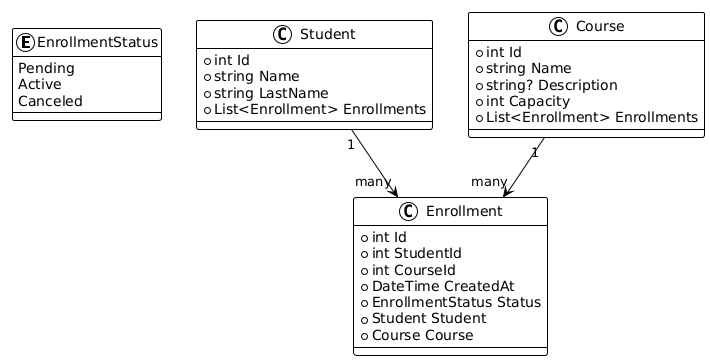
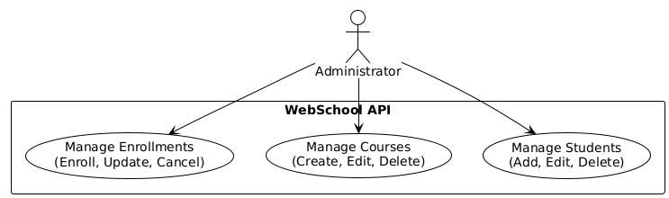

# Sistema de Gestión de Estudiantes y Cursos

Este proyecto es un sistema de gestión de estudiantes y cursos que permite a los administradores gestionar la información de los estudiantes, cursos y matrículas.

## Objetivo General

Desarrollar una API REST completa aplicando arquitectura por capas (API, Application,
Domain, Infrastructure), Entity Framework Core, y MySQL, que permita administrar
estudiantes, cursos e inscripciones.
El objetivo es que el estudiante demuestre dominio de:
    • La estructura de una solución limpia.
    • El uso de EF Core con migraciones.
    • La inyección de dependencias.
    • El consumo de endpoints desde Postman.
    • Relaciones entre entidades.

## Entidades Principales

- **Estudiante**: Representa a un estudiante con atributos como nombre, apellido.
- **Curso**: Representa un curso con atributos como título, descripción y capacidad.
- **Inscripción**: Representa la inscripción de un estudiante en un curso específico.

### Relaciones entre Entidades

- Un estudiante puede estar inscrito en múltiples cursos.
- Un curso puede tener múltiples estudiantes inscritos.

.png)

## Funcionalidades

- **Gestión de Estudiantes**: Permite agregar, editar y eliminar estudiantes.
- **Gestión de Cursos**: Permite crear, editar y eliminar cursos.
- **Gestión de Inscripciones**: Permite inscribir estudiantes en cursos y gestionar las inscripciones existentes.

## Tecnologías Utilizadas

- **Lenguaje de Programación**: C#
- **Plataforma**: .NET 6
- **Framework**: ASP.NET Core
- **Base de Datos**: MySQL

## Arquitectura del Proyecto

El proyecto sigue una arquitectura por capas que incluye:

- **Capa de API**: Maneja las solicitudes HTTP y las respuestas.
- **Capa de Aplicación**: Contiene la lógica de negocio y las reglas de la aplicación.
- **Capa de Dominio**: Define las entidades y sus relaciones.
- **Capa de Infraestructura**: Gestiona la comunicación con la base de datos utilizando Entity Framework Core.

        /WebSchool.sln
        ├── WebSchool.Api/                    → Capa de Presentación (Endpoints)
        │   ├── Controllers/
        │   ├── Program.cs
        │   └── appsettings.json
        │
        ├── WebSchool.Application/            → Capa de Aplicación (Casos de uso)
        │   ├── Interfaces/
        │   │    ├── IStudentService.cs
        │   │    ├── ICourseService.cs
        │   │    └── IEnrollmentService.cs
        │   └── Services/
        │        ├── StudentService.cs
        │        ├── CourseService.cs
        │        └── EnrollmentService.cs
        │
        ├── WebSchool.Domain/                 → Capa de Dominio (Núcleo puro)
        │   ├── Entities/
        │   │    ├── Student.cs
        │   │    ├── Course.cs
        │   │    └── Enrollment.cs
        │   ├── Enums/
        │   │    └── EnrollmentStatus.cs
        │   └── Interfaces/
        │        ├── IStudentRepository.cs
        │        ├── ICourseRepository.cs
        │        └── IEnrollmentRepository.cs
        │
        ├── WebSchool.Infrastructure/         → Capa de Infraestructura (Persistencia)
        │   ├── Data/
        │   │    └── AppDbContext.cs
        │   ├── Repositories/
        │   │    ├── StudentRepository.cs
        │   │    ├── CourseRepository.cs
        │   │    └── EnrollmentRepository.cs
        │   └── Migrations/
        │      └── [EF Core Migration Files]

## Instalación

PEDIENTE

## Uso

Una vez que el servidor esté en funcionamiento, los administradores pueden acceder al sistema a través de Postman y realizar las operaciones necesarias.
