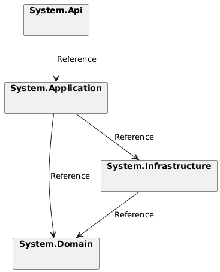
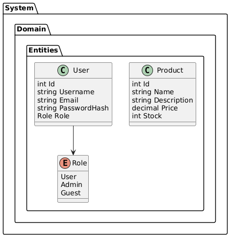
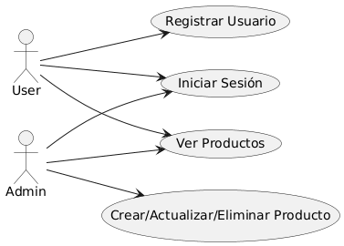
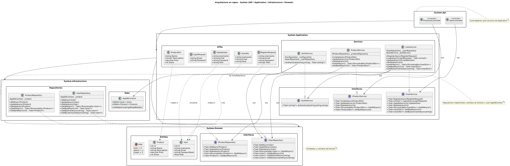

# System - API REST en .NET (Catálogo de Productos)

Este repositorio contiene una API REST construida con **.NET 9** siguiendo una arquitectura en capas: **API**, **Application**, **Domain** e **Infrastructure**. El proyecto implementa gestión de usuarios, productos, autenticación JWT, documentación Swagger y dockerización.

---

## 1. Objetivo

Desarrollar un **Catálogo de Productos** con funcionalidades:

* CRUD de **Usuarios** (roles: Admin, User, Guest).
* CRUD de **Productos**.
* Registro y login mediante **JWT**.
* Documentación automática con **Swagger**.
* Contenerización con **Docker** (API + MySQL).

---

## 2. Estructura de proyectos

La solución contiene cuatro proyectos:

| Proyecto                      | Responsabilidad                                                                               |
| ----------------------------- | --------------------------------------------------------------------------------------------- |
| `webProductos.Api`            | Controladores, configuración JWT y Swagger, entry point `Program.cs`.                         |
| `webProductos.Application`    | DTOs, interfaces de servicios, implementación de la lógica de negocio.                        |
| `webProductos.Domain`         | Entidades (`User`, `Product`), enumeraciones (`Role`) y contratos de repositorio.             |
| `webProductos.Infrastructure` | Implementación de repositorios, `AppDbContext`, migraciones EF Core y configuración de MySQL. |

**Dependencias entre capas:**

* `Api` → consume interfaces de `Application`.
* `Application` → depende de `Domain` (entidades e interfaces) y de `Infrastructure` en tiempo de ejecución.
* `Infrastructure` → implementa interfaces de `Domain` y persiste entidades con `AppDbContext`.



---

## 3. Endpoints principales

### Usuarios (`UserController`)

| Método | Ruta                 | Descripción               | Autorización |
| ------ | -------------------- | ------------------------- | ------------ |
| POST   | `/api/auth/register` | Registrar usuario         | Público      |
| POST   | `/api/auth/login`    | Login → JWT               | Público      |
| GET    | `/api/users`         | Listar todos los usuarios | Admin        |
| GET    | `/api/users/{id}`    | Obtener usuario por id    | Autenticado  |
| PUT    | `/api/users/{id}`    | Actualizar usuario        | Autenticado  |
| DELETE | `/api/users/{id}`    | Eliminar usuario          | Admin        |

### Productos (`ProductsController`)

| Método | Ruta                 | Descripción             | Autorización |
| ------ | -------------------- | ----------------------- | ------------ |
| POST   | `/api/products`      | Crear producto          | Autenticado  |
| GET    | `/api/products`      | Listar productos        | Autenticado  |
| GET    | `/api/products/{id}` | Obtener producto por id | Autenticado  |
| PUT    | `/api/products/{id}` | Actualizar producto     | Autenticado  |
| DELETE | `/api/products/{id}` | Eliminar producto       | Admin        |

> Todas las rutas protegidas requieren token JWT válido.

---

## 4. JWT y seguridad

* Tokens generados con `AuthService` usando clave simétrica (`appsettings.json`).
* Claims principales: `sub` (username), `role` (rol del usuario), `jti`.
* Control de acceso en rutas mediante `[Authorize]` y `[Authorize(Roles = "Admin")]`.
* Buenas prácticas: almacenar la clave JWT en secretos seguros para producción.

---

## 5. Base de datos

* MySQL (ej. Aiven Cloud) usando **Pomelo EF Core**.
* `AppDbContext` con `DbSet<User>` y `DbSet<Product>`.
* Migraciones EF Core configuradas y aplicables con:

```bash
dotnet ef migrations add InitialCreate -p webProductos.Infrastructure -s webProductos.Api
dotnet ef database update -p webProductos.Infrastructure -s webProductos.Api
```

---

## 6. Dockerización

* `Dockerfile` en `webProductos.Api` para publicar la API.
* `docker-compose.yml` opcional con:

```yaml
services:
  api:
    build: ./webProductos.Api
    ports:
      - "8080:8080"
    environment:
      - ConnectionStrings__DefaultConnection=<tu_connection_string>
      - Jwt__Key=<tu_clave_jwt>
  mysql:
    image: mysql:8
    environment:
      MYSQL_ROOT_PASSWORD: root
      MYSQL_DATABASE: defaultdb
```

> Adminer opcional para gestión visual de la DB.

---

## 7. Pruebas unitarias

* Se incluyen pruebas básicas en la capa `Application`:

    * Validación de creación de producto.
    * Verificación de login de usuario.

---

## 8. Despliegue

* API lista para desplegar en **Render**, **Railway** o **Azure**.
* Recomiendo inyectar **secrets** (JWT y ConnectionStrings) desde entorno de despliegue.
* Para desarrollo local, usar `docker-compose up --build`.

---

## 9. Diagrama de arquitectura (simplificado)

```bash
API (Controladores)
   │
   ▼
Application (Servicios / DTOs / Interfaces)
   │
   ▼
Domain (Entidades / Interfaces)
   │
   ▼
Infrastructure (Repositorios / DbContext)
```

---

## Diagramas UML

### Diagrama de clases



### Diagrama casos de uso



## 11. Tecnologías usadas

* .NET 9
* ASP.NET Core Web API
* Entity Framework Core con Pomelo para MySQL
* JWT para autenticación
* Swagger para documentación automática
* Docker para contenerización

---

