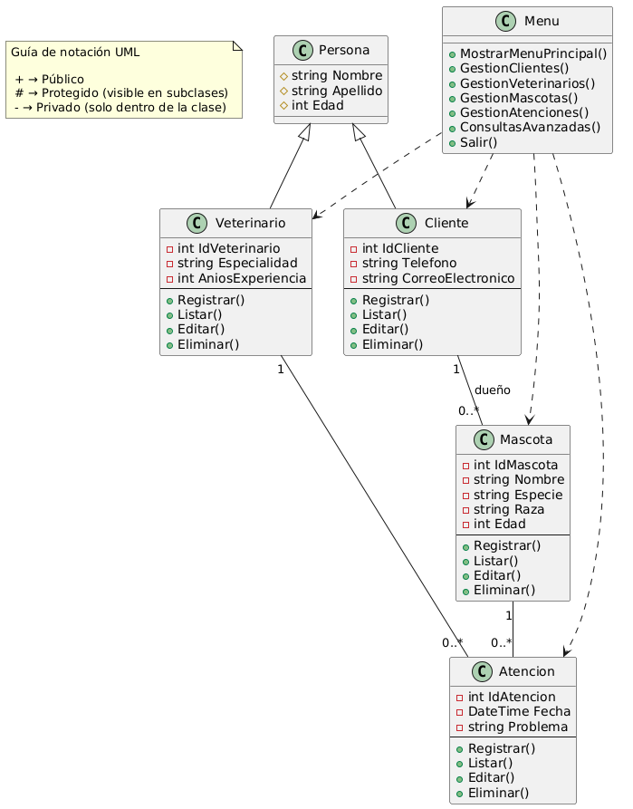
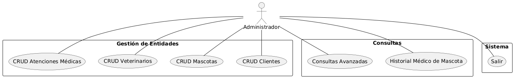

# Sistema Veterinaria San Miguel

## Entidades principales del sistema (Persona, Cliente, Veterinario, Mascota, Atención)

**Persona**: Representa a las personas involucradas en el sistema, ya sean dueños de mascotas o veterinarios. Contiene información como **(Superclase)**

- nombre
- apellido
- edad

Metodos:

- Registrar()
- Listar()
- Editar()
- Eliminar()

**Cliente**: Representa a los dueños de las mascotas. Contiene información como **(hereda de Persona)**

- IdCliente
- nombre _*persona*
- apellido _*persona*
- edad _*persona*
- teléfono
- correo electrónico.

Metodos:

- Registrar()
- Listar()
- Editar()
- Eliminar()

**Veterinario**: Representa a los veterinarios que trabajan en la clínica. Contiene información como **(hereda de Persona)**

- IdVeterinario
- nombre _*persona*
- apellido _*persona*
- edad _*persona*
- especialidad
- años de experiencia

Metodos:

- Registrar()
- Listar()
- Editar()
- Eliminar()

**Mascota**: Representa a las mascotas registradas en la veterinaria. Incluye detalles como

- IdMascota
- nombre
- especie
- raza
- edad
- dueño _*IdCliente*

Metodos:

- Registrar()
- Listar()
- Editar()
- Eliminar()

**Atención**: Registra las consultas y tratamientos realizados a las mascotas. Incluye detalles como

- fecha
- problema
- mascota _*IdMascota*
- veterinario _*IdVeterinario*

---

## Diagrama de clases

## Diagrama de Casos de Uso

