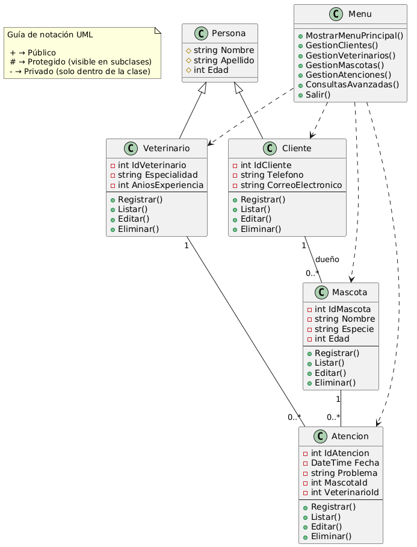

# Sistema Veterinaria San Miguel

## ¿Qué es este proyecto?

Este es un sistema de gestión para una veterinaria, pensado para ser usado desde la consola. Permite registrar y consultar información sobre clientes, mascotas, veterinarios y atenciones (consultas o tratamientos). El objetivo es facilitar la organización y el acceso a los datos más importantes de la clínica veterinaria.

## ¿Qué puedes hacer con este sistema?

- Registrar nuevos clientes (dueños de mascotas) y sus datos de contacto.
- Registrar veterinarios y su especialidad.
- Registrar mascotas y asociarlas a sus dueños.
- Registrar atenciones (consultas, tratamientos, etc.) indicando la mascota, el veterinario y el problema atendido.
- Consultar y editar la información de clientes, veterinarios, mascotas y atenciones.
- Eliminar registros si es necesario.
- Realizar consultas avanzadas como:
	- Ver todas las mascotas de un cliente.
	- Saber cuál es el veterinario que más atenciones ha realizado.
	- Conocer la especie de mascota más atendida en la clínica.
	- Saber qué cliente tiene más mascotas registradas.

## ¿Cómo se usa?

1. **Inicia el programa**: Al abrir la aplicación, verás un menú principal con varias opciones.
2. **Navega por los menús**: Usa el teclado para elegir la opción que deseas (por ejemplo, gestionar clientes, mascotas, veterinarios, atenciones o hacer consultas avanzadas).
3. **Sigue las instrucciones**: El sistema te pedirá los datos necesarios para cada acción (por ejemplo, nombre, edad, especie, etc.). Solo debes escribir la información y presionar Enter.
4. **Consulta y gestiona**: Puedes ver listados, editar o eliminar información fácilmente desde los menús.
5. **Consultas avanzadas**: Si quieres obtener información más específica, entra al menú de consultas avanzadas y elige la consulta que te interese.

## Consejos de uso

- Escribe los datos tal como se piden en pantalla.
- Si no sabes algún dato, puedes dejarlo vacío si el sistema lo permite, pero lo ideal es completar toda la información.
- Si cometes un error al ingresar un dato, puedes editarlo después desde el menú correspondiente.
- Para salir del sistema, elige la opción "Salir" en el menú principal.

---
# Información técnica (para referencia)

# Sistema Veterinaria San Miguel

## Entidades principales del sistema (Persona, Cliente, Veterinario, Mascota, Atención)

**Persona**: Representa a las personas involucradas en el sistema, ya sean dueños de mascotas o veterinarios. Contiene información como **(Superclase)**

- nombre
- apellido
- edad

Metodos:

- Registrar()
- Listar()
- Editar()
- Eliminar()

**Cliente**: Representa a los dueños de las mascotas. Contiene información como **(hereda de Persona)**

- IdCliente
- nombre _*persona*
- apellido _*persona*
- edad _*persona*
- teléfono
- correo electrónico.

Metodos:

- Registrar()
- Listar()
- Editar()
- Eliminar()

**Veterinario**: Representa a los veterinarios que trabajan en la clínica. Contiene información como **(hereda de Persona)**

- IdVeterinario
- nombre _*persona*
- apellido _*persona*
- edad _*persona*
- especialidad
- años de experiencia

Metodos:

- Registrar()
- Listar()
- Editar()
- Eliminar()

**Mascota**: Representa a las mascotas registradas en la veterinaria. Incluye detalles como

- IdMascota
- nombre
- especie
- edad
- dueño _*IdCliente*

Metodos:

- Registrar()
- Listar()
- Editar()
- Eliminar()

**Atención**: Registra las consultas y tratamientos realizados a las mascotas. Incluye detalles como

- fecha
- problema
- mascota _*IdMascota*
- veterinario _*IdVeterinario*

---

## Diagrama de clases

## Diagrama de Casos de Uso

